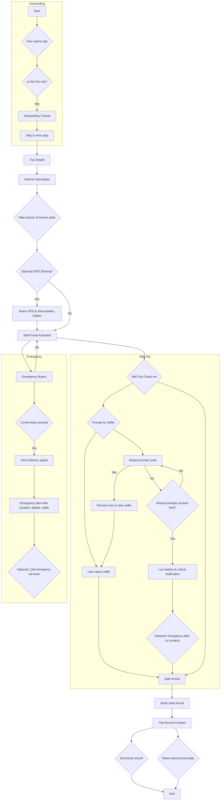

```mermaid
flowchart
  subgraph Onboarding
    A[Start] --> B{User opens app}
    B --> C{Is this first trip?}
    C -- Yes --> D[Onboarding Tutorial]
    D --> E[Skip to next step]
  end
  E --> F[Trip Details]
  F --> G[Vehicle Information]
  G --> H{Take picture of license plate}
  H --> I{Optional GPS Sharing?}
  I -- Yes --> J[Share GPS & show battery impact]
  J --> K[SafeTravel Activated]
  I -- No --> K[SafeTravel Activated]
  K --> L{Mid-Trip Check-ins}
  subgraph Mid-Trip
    L --> M{Prompt for Selfie}
    M --> N{User takes selfie}
    N --> O[Safe Arrival]
    M --> P{Ignore prompt?}
    P -- Yes --> Q[Remind user to take selfie]
    Q --> N[User takes selfie]
    P -- No --> R{Missed prompts exceed limit?}
    R -- Yes --> S[Low battery & critical notification]
    S --> T{Optional: Emergency Alert to contacts}
    R -- No --> P[Repeat prompt cycle]
    T --> O[Safe Arrival]
  end
  K --> U[Emergency Button]
  subgraph Emergency
    U --> V{Confirmation prompt}
    V -- Yes --> W[Send distress signal]
    W --> X[Emergency alert with location, details, selfie]
    X --> Y{Optional: Call emergency services}
  end
  U -- No --> K[SafeTravel Activated]
  L --> O[Safe Arrival]
  O --> Z[Verify Safe Arrival]
  Z --> AA[Trip Record Created]
  AA --> BB{Download record}
  AA --> CC{Share anonymized data}
  BB --> End
  CC --> End


```